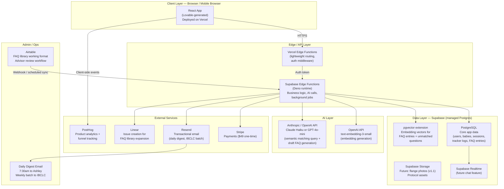

# Technical Design Document — Latched (v1.0)

**Status:** v1.0 draft  
**Last updated:** 2026-05-25  
**Author:** Generated from PRD v0.9, brand guidelines, protocol outline v1, and smart-FAQ library v1.1  
**Intended audience:** Ashley (PM/founder) + any future technical co-founder, contractor, or Lovable developer working on the product

> **How to read this doc:** If you're a developer, this is your build brief. If you're Ashley, skip to the grey boxes marked **"For Ashley"** throughout — they translate each section into plain-English decisions and tradeoffs you need to sign off on before a developer can start.

---

## Table of Contents

1. [Architecture Overview](#1-architecture-overview)
2. [Tech Stack Recommendations](#2-tech-stack-recommendations)
3. [Data Models](#3-data-models)
4. [AI & Semantic Matching System Design](#4-ai--semantic-matching-system-design)
5. [Security & Privacy Design](#5-security--privacy-design)
6. [Phased Implementation Plan](#6-phased-implementation-plan)
7. [Open Technical Questions](#7-open-technical-questions)

---

## 1. Architecture Overview

### 1.1 What We're Building

Latched is a **mobile-first responsive web application** — not a native iOS/Android app. This is a deliberate choice (see Section 2.1). It is built with Lovable (which generates React), hosted on Vercel, and backed by Supabase, which provides the database, authentication, file storage, and serverless functions in a single managed platform. The AI/semantic matching layer uses OpenAI embeddings stored in PostgreSQL via the pgvector extension, which Supabase supports natively.

This architecture was chosen to match three constraints specific to Latched: a solo non-technical founder, a 4–5 month build window, and a healthcare-adjacent product that needs to be privacy-ready and auditable from day one without enterprise infrastructure spend.

### 1.2 High-Level System Architecture



### 1.3 Request Flow — Smart-FAQ Chat (the most complex path)

Understanding this flow end-to-end is essential for any developer working on the chat feature.

```
1. Mom types a question in chat UI
      ↓
2. React app sends question text to Supabase Edge Function
      (authenticated request with JWT — user_id validated)
      ↓
3. Edge Function calls OpenAI embeddings API
      → Embeds the question using text-embedding-3-small
      → Returns a 1536-dimensional float vector
      ↓
4. Edge Function queries pgvector
      → SELECT id, answer, category, escalation_trigger, escalation_text,
               1 - (embedding <=> query_vector) AS similarity
         FROM faq_entries
         WHERE promoted_to_live = true
         ORDER BY embedding <=> query_vector
         LIMIT 1;
      → Returns best match + similarity score
      ↓
5. Edge Function evaluates confidence tier
      → score ≥ 0.82 → HIGH → return canned answer verbatim
      → 0.65–0.81 → MEDIUM → return answer with soft caveat
         (UNLESS category = Breast Health or Emotional Wellness → treat as LOW)
      → < 0.65 → LOW → return refusal message
      ↓
6. Edge Function writes to semantic_match_log (append-only)
      → All fields from PRD §7.5 log schema
      ↓
7. If LOW tier: Edge Function also writes to unmatched_questions
      → Background job triggered (within 60 min) to generate draft FAQ via LLM
      ↓
8. Response returned to React UI
      → UI renders appropriate component (answer / caveat + answer / refusal)
```

### 1.4 Key Architectural Principles

**Privacy by design.** User IDs in all logs are opaque UUIDs — never email, name, or any direct identifier. The semantic match log, unmatched questions table, and draft FAQ entries table contain no PII. PHI (health information) is in the tracker logs (feed/pump data tied to user_id) and separated from the AI pipeline by design. See Section 5 for full detail.

**Append-only audit logs.** The semantic_match_log is append-only with a 24-month minimum retention. No row is ever deleted. This is a hard requirement that must be enforced at the database layer (a Row-Level Security policy that prohibits DELETE on this table, enforced regardless of API key privilege level).

**Embedding model version pinning.** The embedding model version is stored in system configuration and checked by a deployment guard before any release. If the model version changes, all FAQ entry vectors must be regenerated before deployment. This is not optional — mismatched model versions produce unreliable similarity scores.

**Draft entries never reach users.** The `promoted_to_live = false` constraint on all draft FAQ entries is enforced at the database query layer (a filtered index + RLS policy), not just in application code. Application bugs should not be able to surface unreviewed clinical content.

**Offline-first considerations.** Latched is not a fully offline app, but it should degrade gracefully on poor connections — which postpartum moms in hospital rooms frequently have. Protocol module content should be cached in the browser after first load (service worker caching). The tracker should accept inputs optimistically and sync when connection returns. The chat feature requires connectivity but should show a clear, calm error state rather than a broken UI when offline.

---

## 2. Tech Stack Recommendations

> **For Ashley:** This section is the most important one to read if you're onboarding a developer or contractor. Each choice is a decision, not a suggestion — you need to land on a stack before anyone writes a line of production code.

### 2.1 Mobile Framework — Responsive Web App (Lovable / React)

**Recommendation: Continue with Lovable → React, deployed as a Progressive Web App (PWA).**

Latched is already prototyped in Lovable. The output is standard React code that can be ejected and maintained by any React developer. This is the right call for v1 for three reasons:

First, **a responsive web app reaches iOS and Android simultaneously** with a single codebase and no app store review process. For a solo founder with a 4–5 month runway, the alternative — building and maintaining two native apps or a React Native app — costs 2–3x the development time with no user-facing benefit that matters for v1.

Second, **IBCLCs send moms QR codes**. The entire B2B2C acquisition channel depends on a mom scanning a QR code and landing in the product instantly, with no install friction. A native app would require an App Store download step that kills the conversion rate at exactly the most valuable moment.

Third, **the Lovable prototype can be incrementally upgraded** rather than thrown away. A developer can take the Lovable-generated React codebase, clean up the component structure, wire it to Supabase, and ship a production-quality product faster than rebuilding from scratch.

**Configure it as a PWA** so moms can add it to their home screen (iOS: "Add to Home Screen"; Android: browser install prompt). This gives the icon, full-screen experience, and basic offline caching that make it feel native without native build complexity.

*vs. React Native:* More code to maintain, requires Expo expertise, app store submission delays (Apple can take 3–7 days to review), and no meaningful UX advantage for a form-heavy health protocol app at v1.

*vs. Flutter:* Different language (Dart), smaller hiring pool, Google-centric ecosystem that makes Supabase integration slightly more complex. Only worth considering if you raise a round and have budget for platform-native engineers.

### 2.2 Backend — Supabase (BaaS)

**Recommendation: Supabase as the primary backend platform.**

Supabase gives you PostgreSQL (with pgvector), authentication, file storage, Edge Functions (serverless), and Realtime — all in one managed platform with a generous free tier and predictable pricing at early scale. It is already referenced in the PRD and is the natural backend for a Lovable-generated React app.

For Latched specifically, Supabase's native pgvector support is decisive. The semantic matching system (Section 4) needs a vector store. pgvector runs inside your existing Postgres database — no separate Pinecone or Weaviate instance to manage, no additional cost, no data residency complexity. At 100–150 FAQ entries, it performs identically to a dedicated vector store.

Supabase Edge Functions (Deno-based TypeScript) handle the business logic that can't run client-side: embedding generation, confidence tier evaluation, log writes, background job dispatch, and Stripe webhook handling. They are co-located with your data, reducing latency on the embedding → similarity → response pipeline.

*vs. Node/Express on a VPS:* You'd spend the first month configuring a server, setting up CI/CD, managing SSL, configuring connection pooling, and writing authentication middleware — none of which ships product. Supabase does all of that for you.

*vs. Python/FastAPI:* Python is the better choice for ML-heavy systems (fine-tuning, custom inference), but Latched's AI layer is API calls to OpenAI, not local model inference. TypeScript/Deno is sufficient and keeps the stack uniform.

### 2.3 Database — PostgreSQL via Supabase

**Recommendation: PostgreSQL via Supabase, with pgvector enabled from day one.**

PostgreSQL is the right database for Latched at every scale this product will reach. It handles relational data (users, babies, sessions, tracker logs), JSON columns (for flexible protocol module metadata), and vector similarity search (pgvector) in a single engine. There is no realistic scenario where Latched outgrows Postgres.

Enable pgvector immediately — not when you "need it." The FAQ entry table is defined with a vector column from the start. Retrofitting a vector column onto a live production table with rows in it is an avoidable schema migration headache.

*vs. Firebase/Firestore:* NoSQL is a poor fit for this data model. Feed/pump logs, FAQ entries, semantic match logs, and user-baby relationships are all relational. Querying "all unmatched questions from the last 30 days grouped by similarity cluster" is one SQL query; in Firestore it requires multiple round trips and client-side join logic.

*vs. PlanetScale:* MySQL-compatible, lacks native vector support, and adds the complexity of a separate vendor. No advantage over Supabase Postgres for this use case.

### 2.4 AI / Embeddings — OpenAI text-embedding-3-small

**Recommendation: OpenAI `text-embedding-3-small` for all embedding generation, pinned at the current version.**

This is already specified in the PRD and the choice stands. `text-embedding-3-small` produces 1536-dimensional vectors, costs ~$0.02 per 1M tokens (negligible at v1 scale — a library of 150 entries and 1,000 daily chat queries costs less than $0.05/month in embedding calls), and performs well on conversational Q&A pair matching, which is exactly the use case.

The embedding model must be pinned by model string identifier in your Supabase environment configuration. The deployment guard that checks this value is not optional — it is a safety requirement, not a convenience. If OpenAI releases a new version, you will not update to it until you have regenerated all FAQ vectors and re-run your eval set.

For the LLM used in semantic matching and draft FAQ generation: **Claude Haiku** (Anthropic) is the primary recommendation, with GPT-4o-mini as the fallback if Anthropic's API is unavailable. Claude Haiku is faster, cheaper, and produces better-calibrated refusals for healthcare-adjacent content. Both are adequate for the semantic matching role (which is just "pick the best match from a small list" — not generative) and for draft FAQ generation under a tight system prompt.

*vs. open-source sentence-transformers:* Running sentence-transformers requires either a Hugging Face Inference Endpoint (~$10–20/month for a dedicated endpoint) or bundling the model into your serverless function (cold starts, memory limits, Docker complexity). At this scale, the OpenAI API is cheaper, faster to set up, and more reliable. Revisit when volume justifies the fixed cost of a dedicated inference endpoint.

### 2.5 Auth — Supabase Auth

**Recommendation: Supabase Auth with magic link (passwordless) as the primary flow.**

Supabase Auth is built into the platform, handles JWTs, integrates with Row-Level Security policies, and requires zero additional configuration. For a healthcare-adjacent product with a stressed, sleep-deprived user base, **magic link (email link login) is the right primary UX** — no password to forget at 3am, no "forgot password" friction during a feeding crisis.

Social login (Google, Apple) should be available as a secondary option — many moms will want one-tap login on return visits. Apple Sign In is required by the App Store if you ever ship a native app, so it's worth implementing now even for the web version.

*vs. Auth0:* Auth0 adds $23–240/month depending on MAU, requires a separate SDK, and provides features (enterprise SSO, SAML) that Latched will not need for years. The only reason to choose Auth0 over Supabase Auth is if you need a vendor-agnostic auth layer that survives a database migration — a premature concern at v1.

*vs. Firebase Auth:* Firebase Auth is excellent, but it pulls you toward the Firebase ecosystem, which conflicts with the Supabase/Postgres stack choice.

### 2.6 Storage — Supabase Storage

**Recommendation: Supabase Storage for all file assets.**

Protocol module assets (illustrations, diagrams) and any future user-uploaded content (v1.1 flange photos) live in Supabase Storage. It's S3-compatible, built into the platform, and integrates with Supabase's RLS policies so access control is consistent with the rest of your data layer.

For the v1 printable ruler PDF, generate it server-side and serve it from Supabase Storage with a signed URL — not a public URL. Even for a PDF that contains no personal data, not using public URLs establishes a good habit for when flange photos (which are intimate) go into storage in v1.1.

*vs. Cloudflare R2:* R2 has zero egress costs (Supabase Storage charges for egress above the free tier). If your protocol module assets are large and frequently accessed, R2 is worth the extra setup at v1.1. Not worth the additional vendor at v1.

*vs. AWS S3:* Same argument as R2 but with higher egress costs and more IAM complexity. Supabase Storage is S3 under the hood; you get the same durability without the setup overhead.

### 2.7 Push Notifications — Resend (Web Push deferred)

**Recommendation: Email notifications via Resend for v1. Browser Web Push for v1.1.**

For v1, Latched's notifications are email-based: the daily digest to Ashley, the weekly IBCLC batch, and transactional emails (purchase confirmation, week-by-week protocol prompts). **Resend** is the right choice — developer-friendly API, generous free tier (100 emails/day), React Email for templating, and strong deliverability. It's purpose-built for transactional email from developer-first products.

Native push notifications (the kind that appear on the lock screen) require either a PWA service worker (Web Push API) or a native app. Web Push is supported on Android Chrome and, as of iOS 16.4+, on Safari for PWAs added to the home screen. It is worth implementing for v1.1 — specifically for the daily check-in nudge and milestone prompts — but requires the mom to add the app to her home screen first, which limits reach at v1.

Firebase Cloud Messaging (FCM) and OneSignal are the standard choices for cross-platform push at scale. OneSignal's free tier is generous and handles Web Push + future native notifications under one SDK, making it the cleaner long-term choice if you add a native app. Implement it at v1.1 alongside Web Push enablement.

### 2.8 Analytics — PostHog

**Recommendation: PostHog (cloud-hosted) for product analytics.**

PostHog is already named in the PRD and is the right choice for a healthcare-adjacent product: it is self-hostable (important for future HIPAA compliance upgrade), has a generous free tier (1M events/month), and covers session recording, funnel analysis, feature flags, and A/B testing in one tool. The session recording feature is particularly valuable for understanding how moms interact with the onboarding stepper and chat UI.

Implement PostHog in **privacy mode** from day one: mask all input fields in session recordings, disable automatic PII capture, and use PostHog's `identify()` only with opaque user IDs (not email or name). This keeps PostHog clean of PHI and makes a future HIPAA posture much simpler.

*vs. Mixpanel:* Mixpanel is excellent but more expensive at scale ($28/month for the Growth tier that unlocks meaningful retention analysis). PostHog's free tier gets you further, and self-hosting is a future option that Mixpanel doesn't offer.

*vs. Amplitude:* Same argument as Mixpanel — great product, but PostHog's pricing and self-hosting option are better fits for a solo-founder product at this stage.

### 2.9 Hosting / Infrastructure — Vercel + Supabase

**Recommendation: Vercel for the React frontend, Supabase for the backend. No additional infrastructure required for v1.**

Vercel's free tier (Hobby) is sufficient for a soft launch to 5–10 IBCLC partners and the first wave of B2C users. Upgrade to Vercel Pro ($20/month) before scaling paid acquisition — it adds 99.99% uptime SLA, analytics, and higher function timeout limits. Supabase's Pro plan ($25/month) unlocks PITR (Point-in-Time Recovery), which you want before any real user data exists.

Total infrastructure cost at soft launch: **$0–$45/month** (Supabase Free + Vercel Hobby to start; Pro tiers as needed).

*vs. AWS:* AWS is the right answer at Series A. Before that, the setup complexity, IAM configuration, and operational burden of managing EC2/ECS/RDS/CloudFront is not justified by the cost savings. AWS will be necessary when a HIPAA BAA is required (Phase 3) — Supabase and Vercel do not currently offer HIPAA BAAs.

*vs. Railway:* Railway is a solid middle-ground (simpler than AWS, more control than Supabase BaaS), but the Supabase+Vercel combination is better documented, has more community support for Lovable/React projects, and offers the pgvector integration that's central to the AI layer.

### 2.10 Additional Services Summary

| Service | Tool | Cost at Launch | Notes |
|---|---|---|---|
| Payments | Stripe | 2.9% + 30¢/transaction | Already in PRD; use Stripe Checkout hosted page |
| Email | Resend | Free (100/day) | Daily digest, IBCLC batch, transactional |
| Issue tracking | Linear | Free tier | Auto-create issues from digest action links |
| FAQ library | Airtable | $20/month | Advisor review workflow; export to JSON for sync |
| Error monitoring | Sentry | Free tier | Catch Edge Function errors in production |
| Uptime monitoring | Better Uptime | Free tier | Alert if embedding pipeline goes down |

---

## 3. Data Models

> **For Ashley:** These are the tables in your database. Think of each table as a spreadsheet — each column is a field, each row is a record. The relationships between tables (shown in the ERD) are what make the data useful. A developer cannot start database setup without these being agreed on.

### 3.1 Entity Relationship Diagram

```mermaid
erDiagram
    users {
        uuid id PK
        text email
        text chosen_address
        text auth_provider
        text referral_source
        uuid ibclc_partner_id FK
        text stripe_customer_id
        text stripe_purchase_id
        boolean has_paid
        timestamptz paid_at
        timestamptz created_at
        timestamptz updated_at
    }

    user_preferences {
        uuid id PK
        uuid user_id FK
        text display_name
        text address_preference
        text baby_display_name
        text path_selection
        smallint week_postpartum
        date baby_dob
        text pump_brand
        text flange_size_left
        text flange_size_right
        boolean opted_in_followup
        jsonb onboarding_answers
        timestamptz created_at
        timestamptz updated_at
    }

    babies {
        uuid id PK
        uuid user_id FK
        text name
        text nickname
        date date_of_birth
        text sex
        text pronoun_preference
        real birth_weight_grams
        boolean is_premature
        text notes
        timestamptz created_at
    }

    ibclc_partners {
        uuid id PK
        text name
        text credentials
        text hospital_or_practice
        text email
        text referral_code
        text referral_url_slug
        text preferred_contact_method
        text preferred_contact_value
        boolean is_active
        timestamptz created_at
    }

    referral_sources {
        uuid id PK
        uuid ibclc_partner_id FK
        text slug
        boolean is_active
        timestamptz created_at
    }

    user_referrals {
        uuid id PK
        uuid user_id FK
        uuid referral_source_id FK
        timestamptz clicked_at
        timestamptz converted_at
        real conversion_value
    }

    tracker_logs {
        uuid id PK
        uuid user_id FK
        uuid baby_id FK
        text log_type
        text side
        integer duration_minutes
        real output_amount
        text output_unit
        text feed_method
        timestamptz logged_at
        timestamptz created_at
    }

    protocol_modules {
        text id PK
        text path
        smallint week_number
        smallint module_order
        text title
        text lead_line
        text body_content
        text what_to_do
        text watch_for
        text crash_course_content
        boolean is_shared
        boolean is_active
        text version
        timestamptz created_at
        timestamptz updated_at
    }

    user_module_progress {
        uuid id PK
        uuid user_id FK
        text module_id FK
        boolean completed
        timestamptz completed_at
        timestamptz last_viewed_at
    }

    chat_sessions {
        uuid id PK
        uuid user_id FK
        timestamptz started_at
        timestamptz last_turn_at
        integer turn_count
        integer matched_count
        integer refusal_count
    }

    semantic_match_logs {
        uuid event_id PK
        uuid session_id FK
        uuid user_id
        text question_text
        text question_embedding_hash
        text matched_entry_id
        real match_score
        text confidence_tier
        text response_served
        boolean escalation_triggered
        char user_path
        smallint user_week_postpartum
        timestamptz timestamp
        boolean flagged_for_review
        text embedding_model_version
        text library_version
    }

    faq_entries {
        text id PK
        text category
        text[] paths
        text[] weeks
        text[] question_variants
        text answer
        boolean escalation_trigger
        text escalation_text
        text[] sources
        date advisor_reviewed
        date review_due
        text confidence_tier
        text notes
        boolean promoted_to_live
        vector_1536 embedding
        timestamptz created_at
        timestamptz updated_at
    }

    unmatched_questions {
        uuid id PK
        uuid session_id
        uuid user_id
        text question_text
        text question_clean
        vector_1536 question_embedding
        text top_match_id
        real top_match_score
        char user_path
        smallint user_week
        timestamptz submitted_at
        date daily_digest_date
        uuid draft_faq_id FK
        text status
        uuid duplicate_of_id FK
        boolean is_clinical_flag
    }

    draft_faq_entries {
        uuid id PK
        uuid source_question_id FK
        text question_clean
        text[] question_variants
        text draft_answer
        text draft_status
        text suggested_category
        text[] suggested_paths
        text[] suggested_weeks
        boolean needs_ibclc_review
        text cannot_generate_reason
        timestamptz generated_at
        text reviewed_by
        timestamptz reviewed_at
        text reviewer_notes
        text approved_answer
        boolean promoted_to_live
        timestamptz promoted_at
        text live_faq_id
    }

    ibclc_escalations {
        uuid id PK
        uuid session_id FK
        uuid user_id FK
        text trigger_reason
        text escalation_path
        text ibclc_partner_id
        text contact_method_used
        timestamptz triggered_at
    }

    digest_logs {
        uuid id PK
        date digest_date
        text recipient_type
        text recipient_email
        integer questions_included
        integer clinical_flags
        integer drafts_generated
        integer duplicates
        text email_message_id
        text status
        timestamptz sent_at
        timestamptz opened_at
    }

    session_alerts {
        uuid id PK
        uuid session_id UK
        uuid user_id FK
        timestamptz triggered_at
        integer no_match_count
        uuid[] unmatched_question_ids
        text alert_delivery
        timestamptz delivered_at
        timestamptz actioned_at
    }

    users ||--o{ tracker_logs : "logs"
    users ||--o| user_preferences : "has"
    users ||--o{ babies : "has"
    users ||--o{ chat_sessions : "starts"
    users }o--o| ibclc_partners : "referred by"
    chat_sessions ||--o{ semantic_match_logs : "generates"
    faq_entries ||--o{ semantic_match_logs : "matched in"
    unmatched_questions ||--o| draft_faq_entries : "generates"
    users ||--o{ user_module_progress : "tracks"
    protocol_modules ||--o{ user_module_progress : "tracked by"
    ibclc_partners ||--o{ referral_sources : "has"
    referral_sources ||--o{ user_referrals : "drives"
    users ||--o| user_referrals : "attributed via"
    chat_sessions ||--o| session_alerts : "may trigger"
```



### 3.2 Table Definitions

#### users

The core identity record. Contains authentication state, Stripe billing state, and referral attribution. **Does not contain PHI or health information** — those live in user_preferences, babies, and tracker_logs, which are linked by UUID foreign key.

| Column | Type | Notes |
|---|---|---|
| `id` | UUID PK | Supabase Auth UID — the same UUID across all tables |
| `email` | Text | Auth email; never used in logs or AI pipeline |
| `chosen_address` | Text | How she wants to be addressed (her name, "Mama", "Mom", etc.) — set in onboarding |
| `auth_provider` | Text | `email_magic_link`, `google`, or `apple` |
| `referral_source` | Text | `ibclc_referral`, `paid_meta`, `organic_search`, `word_of_mouth`, `unknown` |
| `ibclc_partner_id` | UUID FK → ibclc_partners | Null if direct B2C; populated at signup if IBCLC code detected |
| `stripe_customer_id` | Text | Populated on first Stripe Checkout session |
| `stripe_purchase_id` | Text | Populated on successful payment |
| `has_paid` | Boolean | True after Stripe webhook confirms payment |
| `paid_at` | Timestamptz | Payment confirmation timestamp |
| `created_at` | Timestamptz | Auto |
| `updated_at` | Timestamptz | Auto |

#### user_preferences

All the personalization data collected during onboarding. Separated from `users` so preference data can be updated independently and so the preferences schema can evolve without touching the auth/billing table.

| Column | Type | Notes |
|---|---|---|
| `id` | UUID PK | |
| `user_id` | UUID FK → users | One-to-one |
| `display_name` | Text | First name or nickname as entered |
| `address_preference` | Text | The chosen address form stored for copy rendering |
| `baby_display_name` | Text | Baby's name or nickname |
| `path_selection` | Text | `A` (nursing), `B` (pumping), or `C` (combo) |
| `week_postpartum` | SmallInt | Calculated from baby_dob; used in chat context and module routing |
| `baby_dob` | Date | Used to compute week_postpartum dynamically |
| `pump_brand` | Text | Spectra, Medela, Elvie, Willow, other — populated for paths B and C |
| `flange_size_left` / `_right` | Text | mm size from printable ruler tool — paths B and C |
| `opted_in_followup` | Boolean | Whether she wants the 3/6/12-month follow-up surveys |
| `onboarding_answers` | JSONB | Full onboarding assessment answers — flexible schema |
| `created_at` / `updated_at` | Timestamptz | Auto |

#### babies

Separated from user_preferences because some families may eventually have multiple children (future consideration), and baby data feeds into personalization copy in a distinct way from user preferences.

| Column | Type | Notes |
|---|---|---|
| `id` | UUID PK | |
| `user_id` | UUID FK → users | |
| `name` | Text | Baby's first name |
| `nickname` | Text | Optional; preferred name for personalization copy |
| `date_of_birth` | Date | Used to compute adjusted age |
| `sex` | Text | Optional; biological sex if the parent chooses to provide it |
| `pronoun_preference` | Text | Optional enum: `she/her`, `he/him`, `they/them`, null (default). Used in week-by-week protocol copy to personalize pronoun use (e.g., "she may be cluster feeding" vs. "they may be cluster feeding"). Null means copy defaults to the baby's name only, no pronouns — always a safe fallback. |
| `birth_weight_grams` | Real | Optional; useful context for tracker and module routing |
| `is_premature` | Boolean | Flag for future NICU/preemie content routing |
| `notes` | Text | Optional free text |
| `created_at` | Timestamptz | Auto |

#### ibclc_partners

Each row is a partnered IBCLC. The referral_code and referral_url_slug are the attribution mechanism for the B2B2C channel.

| Column | Type | Notes |
|---|---|---|
| `id` | UUID PK | |
| `name` | Text | Display name for landing page ("Recommended by Sarah, IBCLC") |
| `credentials` | Text | "IBCLC", "RN, IBCLC", etc. |
| `hospital_or_practice` | Text | For landing page social proof |
| `email` | Text | For digest and communications |
| `referral_code` | Text | Short alphanumeric code; used in URL params |
| `referral_url_slug` | Text | e.g. `sarah-memorial` for `latched.com/r/sarah-memorial` |
| `preferred_contact_method` | Text | `email`, `phone`, `sms` — used to build escalation links |
| `preferred_contact_value` | Text | The actual email/phone for escalation routing |
| `is_active` | Boolean | Soft deactivation without deleting |
| `created_at` | Timestamptz | Auto |

#### referral_sources

Each row is a unique referral link — the mechanism through which a specific IBCLC's referrals are tracked. At v1, each partnered IBCLC has exactly one active record. The table is designed to support multiple slugs per IBCLC in the future (e.g., separate links for different clinic locations or campaign contexts).

**Referral slug capture flow:** when a mom arrives via `latched.app/r/[slug]`, the React app reads the slug from the URL path, writes it to `localStorage` under key `latched_referral_slug`, and resolves the IBCLC's display name from this table (joined to `ibclc_partners`) for landing page personalization. The slug persists in `localStorage` through the full onboarding and paywall flow. On account creation, it is read from `localStorage`, a `user_referrals` row is written, and `localStorage` is cleared.

| Column | Type | Notes |
|---|---|---|
| `id` | UUID PK | |
| `ibclc_partner_id` | UUID FK → ibclc_partners | The IBCLC this referral link belongs to |
| `slug` | Text UNIQUE | e.g. `sarah-memorial` for `latched.app/r/sarah-memorial` — globally unique, URL-safe, lowercase |
| `is_active` | Boolean | Soft deactivation; inactive slugs suppress the paywall badge but are still recorded for historical reporting |
| `created_at` | Timestamptz | Auto |

#### user_referrals

The attribution join table. One row per user who arrived via a referral link. Captures the full referral lifecycle: attribution at account creation, and conversion on payment.

**Paywall badge logic:** when the paywall screen renders, the React component reads `latched_referral_slug` from `localStorage`, queries `referral_sources` joined to `ibclc_partners` for the IBCLC's display name, and conditionally renders the "Recommended by [IBCLC Name], IBCLC" badge if `is_active = true`. If the slug is absent, not found, or `is_active = false`, the badge is suppressed. The referral row is written regardless of badge display.

**Conversion tracking:** `converted_at` and `conversion_value` are null until the Stripe webhook fires for a successful payment, at which point both are populated. The webhook handler must be idempotent — a duplicate Stripe event must not overwrite an already-set `converted_at` or create a duplicate row.

| Column | Type | Notes |
|---|---|---|
| `id` | UUID PK | |
| `user_id` | UUID FK → users | Opaque UUID only — not email or name |
| `referral_source_id` | UUID FK → referral_sources | Which referral link brought this user in |
| `clicked_at` | Timestamptz | When attribution was first written (on account creation following referral URL arrival) |
| `converted_at` | Timestamptz | Null until payment confirmed via Stripe webhook; populated then |
| `conversion_value` | Real | Payment amount in USD at time of conversion; $49.00 at v1; null until converted |

> **Reporting note:** a Supabase view joining `user_referrals` → `referral_sources` → `ibclc_partners` provides Ashley with per-IBCLC conversion reporting (total referrals, paid conversions, conversion rate, total revenue) before the Phase 2 IBCLC dashboard is built. See PRD §7.7 for the full reporting requirements.

#### tracker_logs

Event-sourced feed and pump logs. Each log is a single event — not a summary. This keeps the schema simple, allows future aggregation and ML use, and makes it easy to add new log types (weighted feeds, etc.) without schema changes.

| Column | Type | Notes |
|---|---|---|
| `id` | UUID PK | |
| `user_id` | UUID FK → users | |
| `baby_id` | UUID FK → babies | |
| `log_type` | Text | `nursing`, `pumping`, `bottle_expressed`, `bottle_formula`, `combo` |
| `side` | Text | `left`, `right`, `both`, `none` |
| `duration_minutes` | Integer | Nullable for bottle logs |
| `output_amount` | Real | Oz or mL; nullable |
| `output_unit` | Text | `oz`, `ml` |
| `feed_method` | Text | Denormalized convenience field; matches log_type |
| `logged_at` | Timestamptz | When the feed/pump happened (user-entered, can differ from created_at) |
| `created_at` | Timestamptz | When the record was written |

#### faq_entries

The live FAQ library. This is the source of truth for what the semantic matching system can return to users. Only rows where `promoted_to_live = true` are served to users. The `embedding` column stores the pre-computed vector for semantic matching.

> **Critical constraint:** A Postgres RLS policy and a filtered CHECK constraint must prevent any query from returning rows where `promoted_to_live = false`. This is a safety requirement, not just a business rule.

| Column | Type | Notes |
|---|---|---|
| `id` | Text PK | Format: `[CATEGORY_CODE]-[###]` e.g. `SUP-012` |
| `category` | Text | One of the 14 categories |
| `paths` | Text[] | `{A}`, `{B}`, `{C}`, or combinations |
| `weeks` | Text[] | `{1-2}`, `{3-4}`, `{5-6}`, `{all}` |
| `question_variants` | Text[] | 2–4 natural-language phrasings — this is what gets embedded |
| `answer` | Text | Verbatim canned answer, 50–150 words |
| `escalation_trigger` | Boolean | True = answer includes explicit escalation instruction |
| `escalation_text` | Text | Specific escalation language if trigger is true |
| `sources` | Text[] | Source attribution lines |
| `advisor_reviewed` | Date | Null = pending |
| `review_due` | Date | 12 months after last review |
| `confidence_tier` | Text | `high` or `medium` (library-level, separate from match score tier) |
| `notes` | Text | Internal note; never served to users |
| `promoted_to_live` | Boolean | Must be true for entry to be returned by the API |
| `embedding` | Vector(1536) | pgvector; pre-computed from question_variants |
| `created_at` / `updated_at` | Timestamptz | Auto |

#### semantic_match_logs

Append-only. Never deleted. 24-month minimum retention. All fields specified in PRD §7.5. No PII — user_id is an opaque UUID.

*(Full schema defined in PRD §7.5. Reproduced here for completeness.)*

| Column | Type | Notes |
|---|---|---|
| `event_id` | UUID PK | |
| `session_id` | UUID FK → chat_sessions | |
| `user_id` | UUID | Opaque UUID only — not email or name |
| `question_text` | Text | Raw user input, max 500 chars |
| `question_embedding_hash` | Text | SHA-256 of embedding vector |
| `matched_entry_id` | Text | FAQ entry ID, or null |
| `match_score` | Float | Cosine similarity to 4 decimal places |
| `confidence_tier` | Text | `HIGH`, `MEDIUM`, or `LOW` |
| `response_served` | Text | `CANNED_ANSWER`, `CANNED_WITH_CAVEAT`, or `REFUSAL` |
| `escalation_triggered` | Boolean | |
| `user_path` | Char(1) | `A`, `B`, or `C` |
| `user_week_postpartum` | Integer | From user profile at query time |
| `timestamp` | Timestamptz | UTC ISO 8601 |
| `flagged_for_review` | Boolean | Auto-true for all LOW events |
| `embedding_model_version` | Text | Pinned model identifier |
| `library_version` | Text | Version hash of FAQ library at query time |

#### unmatched_questions and draft_faq_entries

Full schemas defined in PRD §7.6. See those schemas verbatim — they are the definitive specification and should be implemented exactly as written, including the indexes and the `duplicate_of_id` self-referential foreign key.

#### ibclc_escalations

Tracks every instance where a user was routed to a human resource through the chat refusal or escalation flow.

| Column | Type | Notes |
|---|---|---|
| `id` | UUID PK | |
| `session_id` | UUID FK → chat_sessions | |
| `user_id` | UUID FK → users | |
| `trigger_reason` | Text | `low_confidence`, `escalation_trigger_in_entry`, `user_requested` |
| `escalation_path` | Text | `ibclc_direct`, `hospital_line`, `ibclc_directory`, `ob_referral` |
| `ibclc_partner_id` | UUID FK → ibclc_partners | Null if no partner attribution |
| `contact_method_used` | Text | What was surfaced to the user |
| `triggered_at` | Timestamptz | |

#### digest_logs

Audit log of every digest email sent — both the daily Ashley digest and the weekly IBCLC batch.

| Column | Type | Notes |
|---|---|---|
| `id` | UUID PK | |
| `digest_date` | Date | The calendar date covered by the digest |
| `recipient_type` | Text | `ashley_daily` or `ibclc_weekly` |
| `recipient_email` | Text | Recipient address |
| `questions_included` | Integer | Count of unmatched questions in this digest |
| `clinical_flags` | Integer | Count of clinical flags |
| `drafts_generated` | Integer | Count of draft FAQs |
| `duplicates` | Integer | Deduplicated questions grouped |
| `email_message_id` | Text | Resend message ID for deliverability tracking |
| `status` | Text | `sent`, `delivered`, `opened`, `failed` |
| `sent_at` | Timestamptz | |
| `opened_at` | Timestamptz | Null until open-tracked |

#### session_alerts

Fires when a single chat session accumulates 3 or more LOW-confidence (no-match) responses. The counter is cumulative across the session — it is not reset when a successful match occurs. At MVP, delivery is an immediate email to Ashley; the `alert_delivery` field is schema-ready for additional channels (e.g., `slack`) without a migration. A UNIQUE constraint on `session_id` ensures at most one alert fires per session, preventing alert storms from a single struggling user.

| Column | Type | Notes |
|---|---|---|
| `id` | UUID PK | |
| `session_id` | UUID UNIQUE FK → chat_sessions | UNIQUE — one alert per session max |
| `user_id` | UUID FK → users | |
| `triggered_at` | Timestamptz | When the 3rd consecutive no-match occurred |
| `no_match_count` | Integer | Will always be ≥ 3 at trigger; may be higher if the session continued |
| `unmatched_question_ids` | UUID[] | References the unmatched_questions rows from this session |
| `alert_delivery` | Text | `email` at MVP; schema-ready for `slack` or other channels later |
| `delivered_at` | Timestamptz | Null until delivery confirmed by Resend webhook |
| `actioned_at` | Timestamptz | Null until Ashley marks the alert reviewed in the admin panel |

---

## 4. AI & Semantic Matching System Design

> **For Ashley:** This section describes exactly how the chat "brain" works — from the moment a mom types a question to the moment she sees an answer. It translates directly from the detailed spec in PRD §7.5 and §7.6 into implementable engineering requirements.

### 4.1 Embedding Pipeline — FAQ Library

The FAQ library is the foundation of the matching system. Every entry must be embedded before it can be matched. Here is the full pipeline, from authoring to live matching:

**Step 1 — Authoring in Airtable.**
Ashley and the IBCLC advisor work in the Airtable FAQ base. Each entry has a `question_variants` field with 2–4 natural-language phrasings of the same question. The advisor sets `advisor_reviewed = today's date` when an entry is approved.

**Step 2 — Export trigger.**
An Airtable automation (or a nightly scheduled Supabase Edge Function polling the Airtable API) detects rows where `advisor_reviewed` is newly populated and `promoted_to_live` is false. These are candidate entries for promotion.

**Step 3 — Embedding generation.**
For each candidate entry, a Supabase Edge Function calls `POST https://api.openai.com/v1/embeddings` with:
```json
{
  "model": "text-embedding-3-small",
  "input": ["variant 1", "variant 2", "variant 3", "variant 4"]
}
```
The API returns four 1536-dimensional vectors. These are averaged into a single representative vector for the entry. (Averaging variants produces a centroid that improves recall for phrasings that fall between two variants.)

**Step 4 — Database write.**
The Edge Function writes a new row to `faq_entries` with the approved content and the averaged embedding vector stored in the `embedding` column (pgvector format). `promoted_to_live` is set to `false` initially.

**Step 5 — Regression check.**
After any batch of ≥5 new entries, the pre-launch eval set is automatically re-run. If HIGH-tier precision drops below 0.95, the batch is rolled back (all new rows deleted) and Ashley is notified via email.

**Step 6 — Promotion.**
If the regression check passes, `promoted_to_live` is set to `true`. The entries become live immediately — no cache invalidation required because pgvector queries filter on `promoted_to_live = true` at query time.

**Step 7 — Library version update.**
The `library_version` identifier in system configuration is updated to a new hash (SHA-256 of all live `faq_entry.id` values sorted). This version is written into every `semantic_match_log` row so you can reconstruct which library version was live at any point in time.

### 4.2 Query Flow — User Question to Response

This is the hot path. It must complete in under 2 seconds end-to-end (embedding API call + pgvector query + Edge Function logic) for the chat to feel responsive.

```
1. User submits question text
   ↓
2. Edge Function receives request
   - Validates JWT (confirms user is authenticated and has paid)
   - Reads user_path and week_postpartum from user_preferences
   - Creates a chat_sessions row if no active session exists
   ↓
3. Embed the question
   - POST to OpenAI embeddings API with question text
   - Returns 1536-dim vector (typically ~100ms)
   ↓
4. Vector similarity search
   SELECT
     id, answer, category, escalation_trigger, escalation_text,
     1 - (embedding <=> $query_vector::vector) AS similarity
   FROM faq_entries
   WHERE promoted_to_live = true
   ORDER BY embedding <=> $query_vector::vector
   LIMIT 1;
   (typically <50ms with an ivfflat index on the embedding column)
   ↓
5. Evaluate confidence tier
   - Extract similarity score from result
   - Determine tier: HIGH (≥0.82) / MEDIUM (0.65-0.81) / LOW (<0.65)
   - Apply Category 9 (Breast Health) and Category 14 (Emotional Wellness) safety override:
     if category IN ('breast_health', 'emotional_wellness') AND score < 0.82:
       force tier = LOW
   ↓
6. Build response
   - HIGH: return answer verbatim, add IBCLC-reviewed badge
   - MEDIUM: prepend soft caveat line, add "Talk to a human" CTA
   - LOW: return refusal message, build escalation links from user context
     (ibclc_partner if present, else hospital line, else IBCLC directory)
   ↓
7. Write semantic_match_log (append-only)
   - All fields from PRD §7.5 schema
   - flagged_for_review = (tier == 'LOW')
   ↓
8. If LOW: write to unmatched_questions
   - Set status = 'new'
   - Dispatch background job (Supabase pg_cron or Edge Function invocation)
     to generate draft FAQ entry within 60 minutes
   ↓
9. Return response to client
   - Include: response_text, confidence_tier, escalation_options (if applicable)
   - Do NOT return: match_score, matched_entry_id, or any internal pipeline data
```

### 4.3 Vector Index Configuration

Without an index, pgvector performs an exact nearest-neighbor scan — accurate but O(n) at query time. At 150 FAQ entries, this is fast enough (sub-5ms). When the library grows past ~500 entries, add an `ivfflat` index:

```sql
-- Create AFTER initial data load (not before — empty index is useless)
CREATE INDEX ON faq_entries
USING ivfflat (embedding vector_cosine_ops)
WITH (lists = 50);
-- lists = sqrt(row_count) is a good starting heuristic
-- Increase to 100-150 when library reaches 1000+ entries
```

For the `unmatched_questions` table, an `ivfflat` index on `question_embedding` is needed for the deduplication query (finding similar questions from the prior 30 days). Add this from the start — unmatched_questions will accumulate rows quickly and the deduplication query runs on every new insert.

### 4.4 Draft FAQ Generation Pipeline

When a LOW-confidence chat turn creates a new `unmatched_questions` row, a background job generates a draft FAQ entry. Here is the Edge Function logic:

**Trigger:** `unmatched_questions` INSERT trigger with `status = 'new'`

**LLM prompt structure:**
```
System: You are a clinical content assistant helping build a library of
        IBCLC-reviewed lactation FAQ entries. Your output will be reviewed
        by a board-certified lactation consultant before any entry goes live.
        You are NOT writing content for users — you are writing a DRAFT for
        expert human review.

        Format your output as JSON with these exact fields:
        - question_clean: a normalized version of the question
        - question_variants: array of 3-4 natural-language phrasings
        - draft_answer: 50-150 words, plain language, 2nd person, no bullets,
          no diagnosis language, no absolute terms (always/never/you must)
        - suggested_category: one of [the 14 categories]
        - suggested_paths: array subset of ['A', 'B', 'C']
        - suggested_weeks: array subset of ['1-2', '3-4', '5-6', 'all']

        If the question involves:
        - Medication names or dosages
        - Symptoms requiring clinical diagnosis (fever, bleeding, lump)
        - Mental health crisis language
        - Topics outside lactation and postpartum feeding
        Respond ONLY with: {"cannot_generate": true, "reason": "[brief reason]"}

        All answers must be sourced from: ABM protocols, LLLI, CDC, AAP, WHO.
        Prefix every draft_answer with: "[DRAFT — NEEDS IBCLC REVIEW] "

User: [question_text from unmatched_questions row]
```

**Output handling:**
- If `cannot_generate = true`: set `draft_status = 'cannot_generate'`, populate `cannot_generate_reason`, mark `is_clinical_flag = true`
- Otherwise: write to `draft_faq_entries` with `draft_status = 'pending_review'` and `needs_ibclc_review = true`
- Update the source `unmatched_questions` row `status` to `'draft_generated'`

**Safety enforcement at the API layer:**
No query against `draft_faq_entries` should ever return a row to the end-user API. A Supabase RLS policy on the `faq_entries` table ensures only `promoted_to_live = true` rows are accessible via the anon/authenticated API keys. Draft entries sit in a completely separate table and are never exposed to client-side queries.

### 4.5 Eval Set and Threshold Validation

Before launch, the following must exist and pass:

**Eval set composition (≥50 pairs):**
- 20 confirmed HIGH-confidence pairs (question + correct matching entry ID, authored by the IBCLC advisor as known-good pairs)
- 15 near-miss pairs (questions topically adjacent to an entry but that should NOT match it — different enough that a HIGH match would be wrong)
- 15 out-of-scope questions (topics the library intentionally doesn't cover: medications, diagnosis, mental health beyond normalization)

**Pass criteria:**
- HIGH-tier precision ≥ 0.95 (at most 1 mismatch in 20 HIGH-confidence responses)
- Refusal rate on out-of-scope questions ≥ 90%
- Zero Category 9 or Category 14 entries returning MEDIUM or HIGH on near-miss questions (safety override must fire)

**Implementation:** A Supabase Edge Function or standalone script that runs the eval set against the live matching pipeline and returns a pass/fail report. This script must be runnable as a CI step before any deployment that changes `faq_entries` or the embedding model configuration.

---

## 5. Security & Privacy Design

> **For Ashley:** Healthcare data is sensitive. This section tells you what you must do before launch, what you can defer, and why. The short version: you are not formally HIPAA-covered at MVP, but you should build as if you will be, because retrofitting privacy practices is much harder than building them in.

### 5.1 HIPAA Posture at MVP — Recommended Position

**Latched at v1 is not a HIPAA-covered entity and does not need a formal HIPAA compliance program at launch.** Here is the reasoning:

HIPAA applies to "covered entities" (health plans, healthcare clearinghouses, healthcare providers) and their "business associates." A direct-to-consumer mobile app that does not bill insurance, does not transmit data to a health plan or provider, and does not have a HIPAA BAA with a covered entity is not subject to HIPAA as written.

The data Latched collects — feed logs, pump duration, baby name, postpartum week — is sensitive but does not meet the legal definition of PHI (Protected Health Information) in the context of a direct-to-consumer app without the required covered entity relationship.

**However, the recommended position is to build HIPAA-ready from day one**, for three reasons:

1. **Phase 3 hospital partnerships will require it.** When Latched enters hospital procurement (Phase 3), hospitals will require a HIPAA BAA, and the technical foundation for that must exist before the sales motion can succeed. Retrofitting HIPAA controls onto a production system is significantly more expensive than building them in.

2. **Trust is your product.** Moms are sharing data about their bodies and their babies with a no-name brand. The signal that you take privacy seriously — communicated through your privacy policy, your data practices, and your in-product disclosures — is a conversion and retention factor.

3. **The FTC Health Breach Notification Rule does apply.** Even without HIPAA coverage, the FTC requires notification to consumers and the FTC itself in the event of a breach of health-related data. You need an incident response plan regardless.

**What "HIPAA-ready but not HIPAA-compliant" means in practice:**
- Use encryption at rest and in transit (covered below) ✓
- Maintain an audit trail of all data access and modifications ✓ (the append-only logs do this)
- No PII in logs or AI pipeline ✓ (pseudonymization with opaque UUIDs)
- Data minimization — collect only what is needed for the product ✓
- A privacy policy that accurately describes what you collect, store, and share ✓
- An incident response plan (write a 1-page document before launch)
- **Do not sign a HIPAA BAA at v1.** Supabase and Vercel do not offer HIPAA BAAs on their standard plans. When Phase 3 hospital partnerships require it, migrate to AWS (which offers BAAs) and upgrade Supabase to a HIPAA-eligible configuration or migrate to self-hosted Postgres.

### 5.2 Data Minimization

The principle: collect the minimum data necessary for the product to function. Apply this at every schema decision.

**What to collect:** user email (auth only), display name and address preference (personalization), baby name and DOB (personalization + week calculation), path selection (protocol routing), tracker logs (product feature + future ML), chat session data (product feature), payment status (gating).

**What NOT to collect:**
- Full legal name (unnecessary — display name suffices)
- Physical address (Latched is a digital product; there is no shipping)
- Phone number (email magic link is sufficient for auth; push notifications are handled via browser tokens, not phone)
- Location beyond timezone (for digest scheduling)
- Baby photos or mom photos in v1 (flange photos in v1.1 will require explicit opt-in and a separate privacy disclosure)
- Insurance information

**Baby name handling:** the baby's name is used exclusively for personalization copy ("Great job with Nora today"). It is stored in `babies.name`, linked to the user's pseudonymous UUID. It does not appear in any log, analytics event, or AI pipeline call. PostHog events reference `user_id` (opaque UUID) only.

### 5.3 Encryption

**In transit:** All communication uses TLS 1.3. This is enforced by Vercel (frontend) and Supabase (API and database connections). No plain HTTP. No exceptions.

**At rest:** Supabase encrypts all database data at rest using AES-256 (managed by the Supabase platform). Supabase Storage objects are encrypted at rest. No additional configuration required — this is the default.

**Application-level encryption:** The tracker logs and user preference data are sensitive but do not require application-level encryption in addition to the platform-level encryption at v1. If a future HIPAA BAA is required, evaluate field-level encryption for the tracker_logs and babies tables using PostgreSQL's pgcrypto extension.

### 5.4 Row-Level Security (RLS)

Supabase's Row-Level Security is a PostgreSQL feature that prevents users from accessing rows that don't belong to them, even if they know the row ID. RLS must be enabled on every table that contains user data.

**Critical RLS policies:**

```sql
-- Users can only read/write their own data
CREATE POLICY "user_own_data" ON tracker_logs
  FOR ALL USING (auth.uid() = user_id);

-- Draft FAQ entries are never accessible via the authenticated API
-- (internal admin access only via service role key)
CREATE POLICY "faq_entries_live_only" ON faq_entries
  FOR SELECT USING (promoted_to_live = true);

-- Semantic match logs: users can read their own; no user can write
-- (writes happen via service role key in Edge Functions only)
CREATE POLICY "match_logs_read_own" ON semantic_match_logs
  FOR SELECT USING (auth.uid() = user_id);
CREATE POLICY "match_logs_no_delete" ON semantic_match_logs
  AS RESTRICTIVE FOR DELETE USING (false);
-- The RESTRICTIVE policy above makes deletion impossible even for service role users
-- who call via the API. Deletion requires direct database access.
```

### 5.5 Logging and Audit Requirements

**Append-only semantic_match_log:** enforced via a RESTRICTIVE RLS DELETE policy (see above). 24-month retention. No automatic deletion policy in place. Any deletion requires a manual database operation with documented justification.

**Supabase audit logging:** Enable Supabase's built-in audit logging (available on Pro plan) to track all schema changes and service-role API calls. This provides the database-level audit trail required for healthcare compliance readiness.

**Application-level events to log:**
- Payment events (purchase, refund) — via Stripe webhook, stored in users table
- Auth events (signup, login, magic link send) — Supabase Auth logs these natively
- IBCLC escalation events — ibclc_escalations table
- Admin actions (Ashley approving a draft FAQ, promoting to live) — tracked via reviewed_by and promoted_at fields in draft_faq_entries

**What NOT to log:** User names, email addresses, baby names, or any PII in any event log. All logs use opaque user UUIDs.

### 5.6 PHI Handling Guidelines

Until a HIPAA BAA is in place, treat the following fields as PHI-equivalent and apply the same controls you would for actual PHI:

- `babies.name` and `babies.date_of_birth`
- `user_preferences.display_name` and `user_preferences.baby_display_name`
- `tracker_logs` (health behavior data tied to a user)
- `unmatched_questions.question_text` (may contain symptom descriptions)
- `semantic_match_logs.question_text`

**PHI-equivalent data must not appear in:**
- PostHog analytics events (use opaque user_id only)
- Error logs or exception reports (Sentry must be configured to scrub these fields)
- Email content beyond the minimum necessary for the feature (the daily digest references question text — this email is sent only to Ashley and the IBCLC, who are internal to the product)
- URL query parameters
- Any third-party service that does not have data processing agreements in place

---

## 6. Phased Implementation Plan

> **For Ashley:** This is the build roadmap in technical terms. Each phase produces something shippable — not a pile of half-finished features. The phases are ordered to give you the fastest path to first revenue while building the technical foundation that later phases depend on.

### Phase 1 — Launchable MVP (Months 1–4)

**What's being built:**
- Supabase project setup: database schema, RLS policies, Auth configuration
- Onboarding flow: assessment, path selection, name preferences, baby details, Stripe payment gate
- Path-specific 6-week protocol: module display, progress tracking, week advancement logic
- Printable ruler flange sizing tool (PDF generation, device-aware rendering)
- Feed/pump tracker: log entry (≤2 taps), 7-day history view, simple chart
- Daily check-in (Flo-style 3-tap screen, contextual module surfacing)
- Smart-FAQ chat: embedding pipeline, pgvector matching, confidence tier logic, log writes, unmatched question capture
- IBCLC referral attribution: slug resolution, landing page personalization, code cookie persistence through funnel
- Email infrastructure: Resend integration, purchase confirmation, weekly protocol prompts
- Daily digest and IBCLC weekly batch email (Resend + Supabase scheduled function)
- Graduation screen: tracker summary, testimonial ask, referral prompt
- PostHog instrumentation: funnel events, tracker engagement, chat match rate
- Stripe webhook: purchase confirmation → has_paid flag

**Why in this order:** Revenue requires the payment gate, which requires onboarding, which requires the protocol. The chat feature can be built in parallel with the protocol content — the embedding pipeline is independent of the module content. The digest is required for Ashley's post-launch triage workflow, so it must ship with (not after) the chat.

**Estimated complexity:** XL — this is the full MVP build

**Key technical risks:**
- **Embedding pipeline correctness** — must pass the pre-launch eval set before chat goes live. Budget 2–3 days for eval set construction and threshold calibration. This is not a task to defer to launch week.
- **RLS policy correctness** — a misconfigured RLS policy can either expose data between users or prevent features from working. Test every policy with a separate test user account, not just the dev account.
- **Stripe + Supabase auth handshake** — the flow from "checkout complete" to "has_paid = true in database" involves Stripe webhooks, Edge Function processing, and database writes. Test the full flow including failed payments and refunds.
- **Week calculation logic** — `week_postpartum` is computed from `baby_dob` and used in module routing, chat context, and the semantic match log. A bug here surfaces the wrong protocol content. Write unit tests for this calculation.

### Phase 2 — Optimization and IBCLC Dashboard (Months 5–7 post-launch)

**What's being built:**
- IBCLC Tier 2 dashboard: aggregate, anonymized metrics per referral code (total signups, week-1 completion, week-6 graduation rate, aggregate NPS). No patient-level PHI.
- Library expansion tooling: admin UI for Ashley to action digest items (approve / reject / flag) without relying solely on email links
- Web Push notifications via service worker (opt-in nudge for daily check-in, milestone prompts)
- Smart-FAQ v1.1 library expansion: target 300–500 entries, driven by real query telemetry from v1
- Answer personalization: slot-fill user path and week into canned answers at response time (rules-based, not generative)
- Standalone searchable FAQ library (the "Is this normal?" reference experience)
- Weeks 7–12 "Continue Your Journey" extension: minimal content initially, full content authored from real week 1–6 query data

**Why in this order:** The IBCLC dashboard is the retention mechanism for the B2B2C channel — without it, IBCLC referral motivation decays. Library expansion must be data-driven (real queries from real users), not guessed at, so it cannot happen before launch. Push notifications require the Web Push service worker, which must be tested for iOS PWA compatibility (added in iOS 16.4 but still buggy in some edge cases).

**Estimated complexity:** L

**Key technical risks:**
- **IBCLC dashboard privacy** — the dashboard shows aggregate stats that must not be reverse-engineerable to individual patients. If a cohort is small (e.g., one IBCLC with two referred moms), "aggregate" stats effectively identify individuals. Apply k-anonymity: suppress stats for cohorts below k=5.
- **Airtable → database sync reliability** — the promotion pipeline from Airtable to live FAQ entries must be idempotent (running twice produces the same result) and must surface failures clearly. A silent sync failure means new entries silently fail to go live.

### Phase 3 — AI Vision Flange Tool and RAG Exploration (Months 8–12 post-launch)

**What's being built:**
- AI vision-based flange fitting (v1.1): photo capture with explicit privacy consent, Claude Sonnet vision or GPT-4o vision for sizing recommendation, comparison against printable ruler ground truth
- RAG-with-refusal chat architecture (v1.2): if library has matured to ~500+ entries and coverage gap persists — see PRD §10 for preconditions
- Native push notifications (OneSignal SDK) for Android; iOS requires App Store submission path decision
- Performance optimization: implement pgvector ivfflat index tuning as library grows

**Why in this order:** The AI flange tool requires the accuracy benchmark to pass (≥85% within-one-size against IBCLC ground truth across 20+ moms) before shipping. RAG is gated on preconditions defined in PRD §10 — specifically, a larger library, stronger advisor cadence, and output classifier tooling. Do not advance to RAG until smart-FAQ has genuinely saturated.

**Estimated complexity:** L–XL (depends on whether RAG preconditions are met)

**Key technical risks:**
- **Flange photo privacy infrastructure** — intimate photos require end-to-end encrypted storage, strict access controls, explicit user consent flow, and a data retention/deletion policy. The storage bucket for flange photos must be private (no public URLs, signed URLs only, 15-minute expiry). Photos must never be logged or cached outside the storage bucket.
- **RAG hallucination surface area** — if RAG is built prematurely without the clinical reviewer cadence and output classifier specified in PRD §10, it creates a clinical liability that smart-FAQ explicitly avoids. The preconditions are gating, not aspirational.

### Phase 4 — HIPAA Compliance and Hospital Partnerships (Months 12–18 post-launch)

**What's being built:**
- Infrastructure migration for HIPAA: move to AWS or evaluate Supabase HIPAA-eligible tier, execute BAA with infrastructure providers
- SOC 2 Type II preparation: formal access control policies, audit logging completeness review, penetration testing
- Hospital-grade IBCLC dashboard: patient-level data visibility (requires explicit patient consent and hospital BAA)
- Enterprise billing and provisioning for hospital procurement

**Why in this order:** Hospital procurement gates on HIPAA BAA + SOC 2. These are 6–12 month processes. Begin preparation at Month 12 to be ready for hospital sales conversations at Month 18+. Do not attempt hospital enterprise sales without these in place.

**Estimated complexity:** XL

**Key technical risks:**
- **Vendor HIPAA BAA availability** — Supabase's HIPAA BAA availability and pricing should be confirmed before Phase 4 planning. As of the time of this document, AWS is the safest choice for HIPAA BAA coverage. Plan for a potential data migration.
- **Patient-level IBCLC dashboard consent** — surfacing individual patient data to an IBCLC requires explicit, documented consent from the patient. This is a legal and UX requirement, not just a technical one.

---

## 7. Open Technical Questions

These are the decisions that are genuinely unresolved and need input from Ashley or a future technical co-founder/contractor before a developer can implement the relevant feature.

### Q1 — Lovable codebase ownership and ejection point

Lovable generates React code that lives in a Lovable project. At some point, the codebase needs to be ejected into a standalone Git repository that a developer owns and deploys independently. **When does this happen?**

Options: (a) immediately — eject now and have a developer maintain it from day one; (b) at the transition from prototype to production build (recommended — eject when the MVP build begins in earnest); (c) never — stay fully in Lovable until it becomes limiting.

The risk of staying in Lovable too long is that it constrains developer ergonomics and makes certain customizations (custom Supabase Edge Functions, complex RLS logic, pgvector integration) harder to implement cleanly. Option (b) is recommended.

### Q2 — Embedding model update policy

The PRD specifies that the embedding model must be pinned and that all vectors must be regenerated when the model changes. **Who owns this process, and what is the trigger cadence?**

Recommendation: designate one person as the "embedding model owner." Any OpenAI announcement of a new `text-embedding-3-*` model version triggers a review. The review has three steps: (1) run the eval set against the new model, (2) compare precision to the current model, (3) only upgrade if precision is equal or higher and all eval pass criteria are met.

### Q3 — Admin panel architecture

The daily digest uses email-based action links for triage. The PRD recommends email-only at v1, with a mobile-optimized admin panel as a Phase 2 feature. **Confirm this decision before the digest is built.**

If Ashley prefers an in-app admin panel from day one, it adds ~2–3 weeks of development time but removes the dependency on email deliverability for critical workflows. The action links in email require pre-authenticated deep links (valid for 48 hours) — these are implementable but add complexity to the auth middleware.

### Q4 — Stripe configuration: one-time vs. subscription model

The PRD specifies $49 one-time. **Confirm before Stripe is configured that there is no plan to add a subscription component at v1 (e.g., a monthly subscription for the weeks 7–12 extension).**

If a subscription may be added later, configure Stripe with Products and Prices from the start (not a simple Checkout link) so subscription products can be added without restructuring the billing integration.

### Q5 — Linear workspace and label structure for digest automation

The daily digest auto-creates Linear issues when Ashley approves a draft FAQ entry. **What Linear project and label structure should issues be created in?**

The PRD recommends: `Project: Content Library`, `Label: FAQ Expansion`, priority Medium by default, High for clinical flags, Urgent for `cannot_generate` safety cases. Confirm this before the digest automation is built.

### Q6 — PostHog data governance and EU/US data residency

PostHog's cloud-hosted version stores data in the US by default (EU option available). **Confirm whether US data residency is acceptable, or whether EU hosting is required for any current or anticipated international users.**

At v1 (US-focused launch), US residency is appropriate. If non-US expansion is planned within 12 months, evaluate PostHog EU cloud or self-hosted PostHog.

### Q7 — Weeks 7–12 "Continue Your Journey" minimal viable content

The PRD specifies that the weeks 7–12 extension module must have *some* content at the week-6 graduation screen, but does not specify what the minimum viable content is. **Before development begins on the graduation screen, decide: is the graduation screen a teaser ("Coming soon — here's a preview of weeks 7–12") or a thin content stub ("Here are 3 things to know about months 2–3")?**

This determines whether protocol content for weeks 7–12 must be partially authored before launch or whether a well-crafted teaser screen is acceptable.

### Q8 — Backup and disaster recovery targets

Before launch, define explicit RPO (Recovery Point Objective) and RTO (Recovery Time Objective):
- **RPO** — how much data can you afford to lose if the database goes down? (e.g., 1 hour = nightly backups are insufficient; enable Supabase PITR on the Pro plan)
- **RTO** — how long can Latched be down before it's a serious problem for users? (A mom at 3am with a refusal answer and no chat access is a real-world failure scenario)

Recommendation: RPO = 1 hour (enable Supabase PITR), RTO = 30 minutes (Supabase manages this via multi-zone replication on Pro plan). Confirm before the Pro plan upgrade decision.

### Q9 — IBCLC dashboard: first technical implementation

The IBCLC Tier 2 dashboard is Tier 2 in the PRD (ship if scope allows). **Confirm the MVP feature set: the minimal set of metrics and UI needed to keep an IBCLC referring after their first 5 patients.**

A developer needs to know whether this is a simple static stats page (total signups, completion rates, no interactivity) or a lightweight analytics dashboard (filterable by date, downloadable). The former is ~1 week of work; the latter is ~3–4 weeks.

### Q10 — Sentry scrubbing configuration

Sentry must be configured to scrub PII from error reports before any user traffic hits the system. **Confirm the list of fields to scrub:**

Recommended scrub list: `email`, `display_name`, `baby_display_name`, `question_text` (from error context), `name` (from any object with a name field), `dob`, `date_of_birth`. Sentry's `before_send` hook can filter these — a developer needs to implement and test this before launch, not after.

---

## Appendix A — Technology Choices Reference Summary

| Layer | Chosen Tool | Key Alternative Considered | Decision Rationale |
|---|---|---|---|
| Frontend | React (via Lovable) + Vercel | React Native, Flutter | PWA for zero-install QR acquisition; Lovable prototype already exists |
| Backend | Supabase Edge Functions | Node/Express, FastAPI | Integrated with DB; no server management; pgvector native |
| Database | PostgreSQL via Supabase | Firebase, PlanetScale | Relational + vector in one engine; pgvector native |
| Vector store | pgvector (in Postgres) | Pinecone, Weaviate | Same database; no additional vendor; sufficient at v1 scale |
| Embedding model | OpenAI text-embedding-3-small | sentence-transformers | No inference infrastructure; negligible cost; better out-of-box accuracy |
| Chat LLM | Claude Haiku (Anthropic) | GPT-4o-mini | Better calibrated refusals; healthcare-adjacent use case |
| Auth | Supabase Auth | Auth0, Firebase Auth | Built-in; RLS integration; no additional cost |
| Storage | Supabase Storage | Cloudflare R2, AWS S3 | Built-in; consistent access control; sufficient at v1 |
| Email | Resend | SendGrid, Postmark | Developer-friendly; React Email templates; generous free tier |
| Analytics | PostHog | Mixpanel, Amplitude | Self-hostable; healthcare-aware; free tier adequate |
| Payments | Stripe | n/a | Industry standard; best docs; most IBCLC/healthcare-app precedent |
| Issue tracking | Linear | Jira, Notion | Already in Ashley's stack (referenced in PRD); auto-issue creation |
| FAQ library | Airtable | Google Sheets, Notion | Rich field types; advisor-friendly; webhook for promotion automation |
| Error monitoring | Sentry | Datadog, Rollbar | Generous free tier; React + Supabase SDK support |

---

## Appendix B — Pre-Launch Technical Checklist

This checklist must be completed before any user traffic is allowed into the production environment.

**Database and infrastructure:**
- [ ] Supabase Pro plan enabled (PITR enabled, higher connection limits)
- [ ] pgvector extension enabled: `CREATE EXTENSION IF NOT EXISTS vector;`
- [ ] All RLS policies implemented and tested with a non-admin test user
- [ ] RESTRICTIVE DELETE policy on `semantic_match_logs` confirmed
- [ ] `promoted_to_live = false` access restriction on `faq_entries` confirmed
- [ ] ivfflat index on `unmatched_questions.question_embedding` created

**AI pipeline:**
- [ ] Embedding model version pinned in Supabase environment config
- [ ] Deployment guard checking model version is implemented
- [ ] Pre-launch eval set of ≥50 pairs built and reviewed by IBCLC advisor
- [ ] Matching pipeline achieves ≥0.95 precision on HIGH tier against eval set
- [ ] Refusal rate ≥90% on out-of-scope eval questions
- [ ] Category 9 and Category 14 safety overrides tested (MEDIUM → LOW)
- [ ] All three response types (CANNED_ANSWER, CANNED_WITH_CAVEAT, REFUSAL) render correctly in UI

**Security:**
- [ ] All API endpoints require valid JWT (no unauthenticated data access)
- [ ] Sentry PII scrubbing configured and tested
- [ ] PostHog privacy mode enabled; no PII in analytics events
- [ ] Stripe webhook signature verification implemented
- [ ] All storage URLs are signed (not public); expiry ≤ 24 hours

**Audit and logging:**
- [ ] Every chat turn writes to `semantic_match_logs` — verified with test turns
- [ ] LOW-tier turns write to `unmatched_questions` within 60 seconds — verified
- [ ] Draft FAQ generation runs within 60 minutes of new unmatched question — verified
- [ ] Daily digest delivers at 7:30am with correct prior-day data — verified in staging
- [ ] `library_version` and `embedding_model_version` populated on every log row

**Compliance readiness:**
- [ ] Privacy policy published and linked from every entry point
- [ ] No PII in any URL query parameter (referral code in URL is acceptable; user ID or email is not)
- [ ] Incident response plan (1-page document) exists and has been reviewed
- [ ] Data retention policy documented: 24-month minimum for logs; user data deletion process defined

---

*This document is a living artifact. Update Section 7 (Open Technical Questions) as decisions are made. Flag any section that becomes outdated as the build progresses.*

*Next review: when Phase 1 development begins, or when a technical co-founder/contractor joins.*
